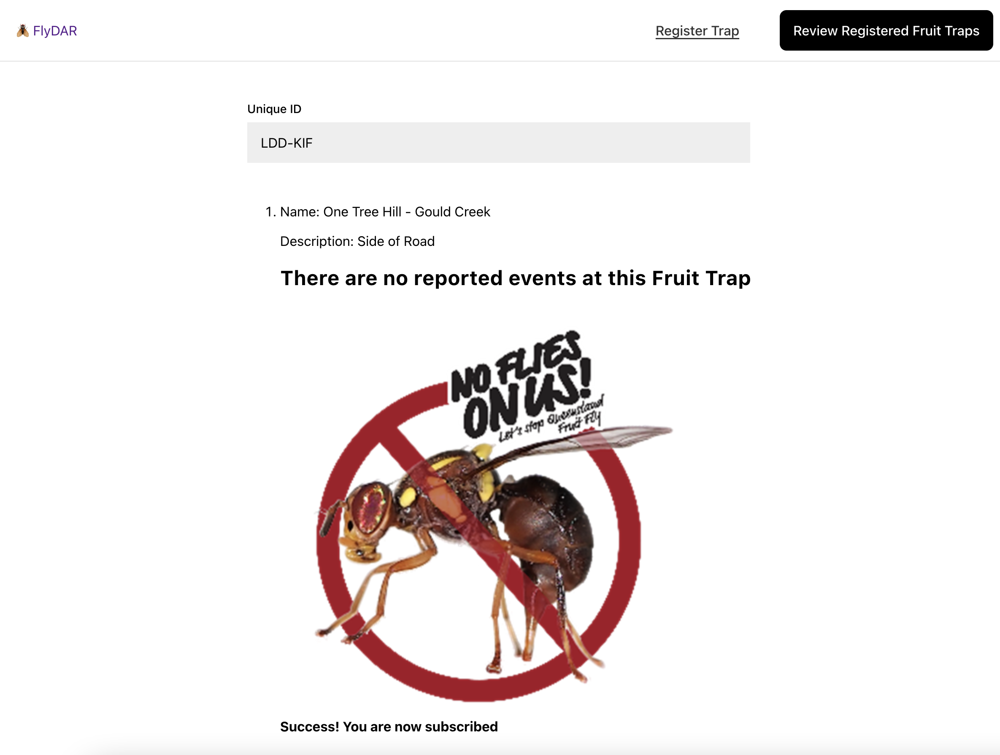

# 🪰 FlyDar

## Fruit fly can have a devastating impact on local horticulture industries:

- Fruit fly outbreaks in areas that are normally free of these pests can cause hundreds of millions of dollars a year in lost income and eradication costs.
- Controlling fruit flies can be a major expense for large scale commercial producers, leading to higher prices for consumers.
- Infested fruit is not suitable for sale, therefore reducing orchard productivity. In severe cases, entire crops can be made worthless.
- The imposition of interstate and international quarantine conditions either limits market access opportunities or makes it more expensive.

## Presentation Videos

- [https://www.youtube.com/watch?v=Gsn4ufs\_\_EA&feature=youtu.be](https://www.youtube.com/watch?v=lZK5bui-B1A)

## How to run it

- python3 -m venv venv
- source venv/bin/activate
- pip install -r requirements.txt
- cd frontend && npm install && npm run build
- python manage.py runserver

## App Screenshots

